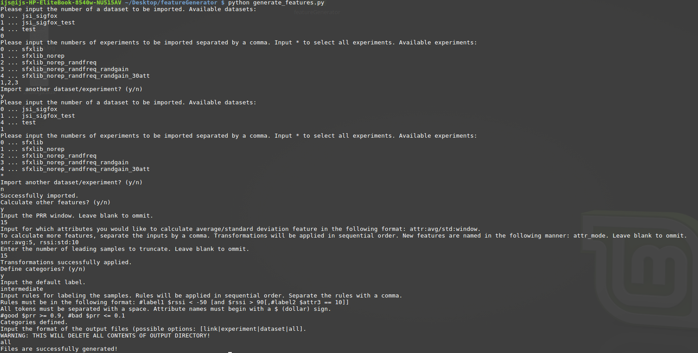

# Feature generator

Feature generator is a Python script used for extraction and computation of new features from generic data. Output of this script is labelled data in [Attribute-Relation File Format](http://www.cs.waikato.ac.nz/ml/weka/arff.html) (ARFF), which can be further used for data modelling.

## Directory structure

<dl>
  <dt>datasets</dt>
  <dd>Input datasets that must be in the common format.</dd>

  <dt>generate_features.py</dt>
  <dd>Feature generator script.</dd>

  <dt>output</dt>
  <dd>Output directory where resulting ARFF data is output.</dd>

  <dt>use_case.png</dt>
  <dd>Image illustrating a simple use case.</dd>
</dl>

## Getting Started

These instructions will get you a copy of the Feature generator up and running on your local machine for development and testing purposes. The rest of this section assumes a Linux (namely Linux Mint) machine is being used.

### Prerequisites

Feature generator requires Pyton 2.7 and the following Python packages:

* NumPy
* natsort

One way of installing Python 2.7:

```shell
sudo apt-get install python
```

One may install the Python packages in the following manner:

1. Install pip: `sudo apt-get install python-pip`
2. Install the packages: `pip install numpy natsort`


### Usage

First, we must copy our data (which must be in common format) to the *datasets* directory. Next, we run the script:

```shell
python generate_features.py 
```

Then, we simply follow the on-screen instructions.


#### Input file format

All of our [datasets](../datasets) include a script that can be used for transforming data to the common format.

###### Specification of the common format
Directory structure:

> * Each **dataset directory** must be named in the following way: *dataset-datasetnumber-dataset_description*, e.g. *dataset-0-jsi_sigfox_test*. Each dataset must have a unique number, words in dataset description must be separated by an underscore. No special characters are permitted, all letters are lowercase.
> * In dataset directory, there are one or more **experiment directories**. Experiment is a distinct set of links, that have some common characteristic, e.g. same transmission power. Experiment directories are named in the following manner: *experiment-experimentnumber-experiment_description*, e.g. *experiment-0-sfxlib_norep_randfreq*.  Each experiment must have a unique number, words in experiment description must be separated by an underscore. No special characters are permitted, all letters are lowercase.
> * In experiment directory, there are one or more **link files**. They are named in the following manner: *trans-transmitternumber-recv-receivernumber.csv*, e.g. *trans-0-recv-1.csv*. Additional arbitrary information may also be provided as long as the regulatory part of the naming stays intact, each part of the information must be separated by a dash (-). Additional information must come after the regulatory part and before the filename extension, e.g. *trans-0-recv-1-location-0-pga_gain-0.csv*.

Link file structure:

> Link files are regular csv files with a header line. Position of attribute names in header can be arbitrary, although it's desirable that names of the attributes comply to the following list:
```
Sequence number ---------- seq (integer/float)
RSSI --------------------- rssi (integer/float)
SNR ---------------------- snr (integer/float)
Timestamp ---------------- timestamp (integer/float)
Transmission power gain -- gain (integer/float)
Packet received ---------- received (boolean, true|false)
```
> Sequence number of the first packet that should've been received must be 0. When using interpolation for calculation of missing values for lost packets, *received* column must be included. If a new attribute name must be introduced, snake case (lowercase with underscores) is prefered.

#### Output file format

Output file is in *Attribute-Relation File Format* (ARFF), which is specified [here](http://www.cs.waikato.ac.nz/ml/weka/arff.html).

#### Sample use case


